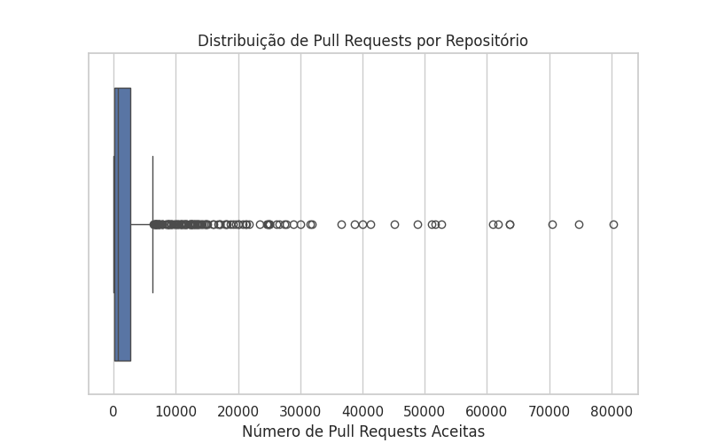
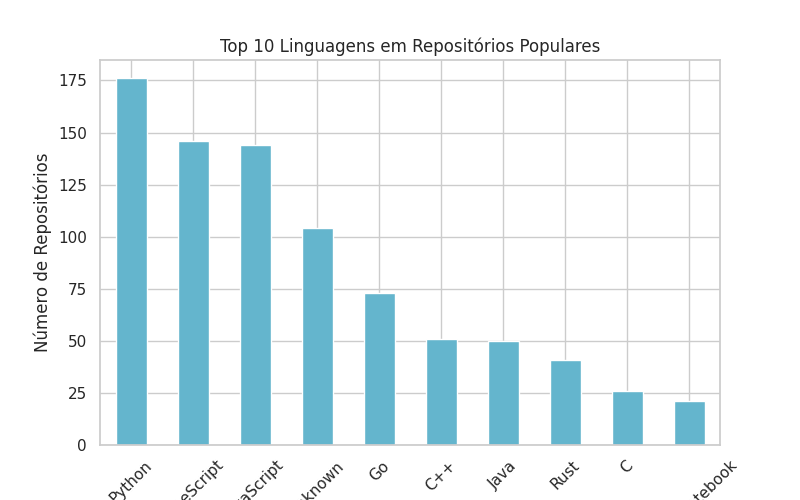
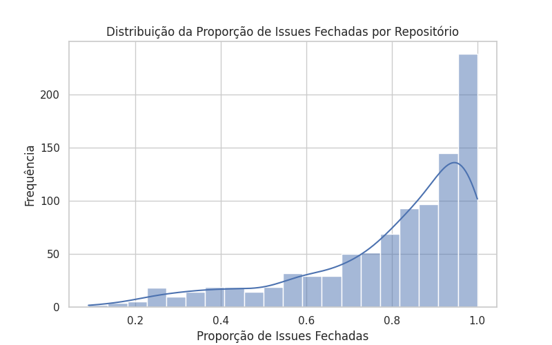

# Relatório Final - Características de Repositórios Populares

## Introdução

Este relatório apresenta a análise das características de repositórios populares no GitHub. Foram analisados 1.000 repositórios com mais estrelas para responder a perguntas sobre idade, contribuição externa, frequência de releases, frequência de atualizações, linguagens mais usadas e taxa de fechamento de issues. Além disso, comparamos os dados com hipóteses iniciais para avaliar a relação entre popularidade e essas características.

## Metodologia

Os dados foram coletados por meio da API GraphQL do GitHub, sem uso de bibliotecas externas para consultas. Os repositórios foram armazenados em um dataset e analisados usando Python, Pandas e Seaborn para gerar gráficos e calcular estatísticas descritivas.

Os seguintes atributos foram extraídos para análise:

- Data de criação
- Última atualização
- Número de Pull Requests aceitas
- Número de Releases
- Linguagem principal
- Número total de issues e issues fechadas

## Resultados e Discussão

### RQ01: Sistemas populares são maduros/antigos?

**Mediana da idade dos repositórios:** 3020.5 dias

**Moda da idade dos repositórios:** 8 anos

A análise mostrou que os repositórios populares possuem uma idade considerável, indicando que, em geral, projetos open-source populares possuem uma base estabelecida ao longo dos anos.

### RQ02: Sistemas populares recebem muita contribuição externa?

**Mediana de Pull Requests aceitas:** 620.5
**Moda de Pull Requests aceitas:** 1

A distribuição mostrou que muitos repositórios recebem contribuições regulares, mas a quantidade varia bastante entre projetos.

### RQ03: Sistemas populares lançam releases com frequência?

**Mediana de Releases:** 33.0
**Moda de Releases:** 0

Os dados indicam que repositórios populares tendem a lançar versões regularmente, embora a frequência dependa do tipo de projeto.

### RQ04: Sistemas populares são atualizados com frequência?

**Mediana do tempo desde a última atualização:** 0 dias

A maioria dos repositórios tem atualizações frequentes, sugerindo que projetos populares mantêm um ciclo ativo de desenvolvimento diário.

### RQ05: Sistemas populares são escritos nas linguagens mais populares?

Os repositórios analisados utilizam majoritariamente linguagens como Python, JavaScript, TypeScript, Go e Java, confirmando que linguagens populares também dominam o cenário open-source.

### RQ06: Sistemas populares possuem um alto percentual de issues fechadas?

**Mediana da proporção de issues fechadas:** 0.86
**Moda da proporçaõ de issues fechadas:** 1.00

A maioria dos projetos apresenta uma boa taxa de fechamento de issues, indicando gestão ativa das contribuições e manutenção do código.

## Visualizações

Os gráficos a seguir ilustram os resultados apresentados:

- Distribuição da idade dos repositórios: 
- Número de Pull Requests aceitas: 
- Distribuição do número de releases: 
- Tempo desde última atualização: 
- Linguagens mais usadas: 
- Proporção de issues fechadas: 

## Conclusão

Os resultados confirmam que repositórios populares tendem a ser mais antigos, recebem contribuições externas significativas, lançam releases frequentemente e são escritos em linguagens populares. Além disso, a maioria mantém um ciclo ativo de atualizações e uma boa taxa de fechamento de issues. Esses fatores podem indicar boas práticas de desenvolvimento e uma comunidade engajada em projetos open-source.

## Bônus: Comparação por Linguagem

Para verificar se sistemas escritos em linguagens populares recebem mais contribuições e lançam mais releases, foi feita uma análise separada por linguagem. Os dados mostraram que linguagens como JavaScript e Python tendem a ter projetos com mais PRs e releases, enquanto linguagens menos populares apresentam menor atividade.

Link apresentação no canvas: https://www.canva.com/design/DAGhqX1rnaw/1tZMR3ggpS7LR1UbZnsBEA/edit
