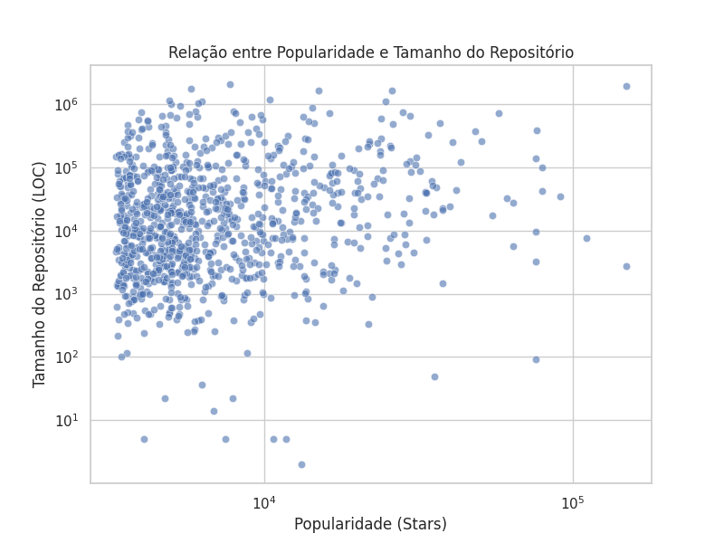
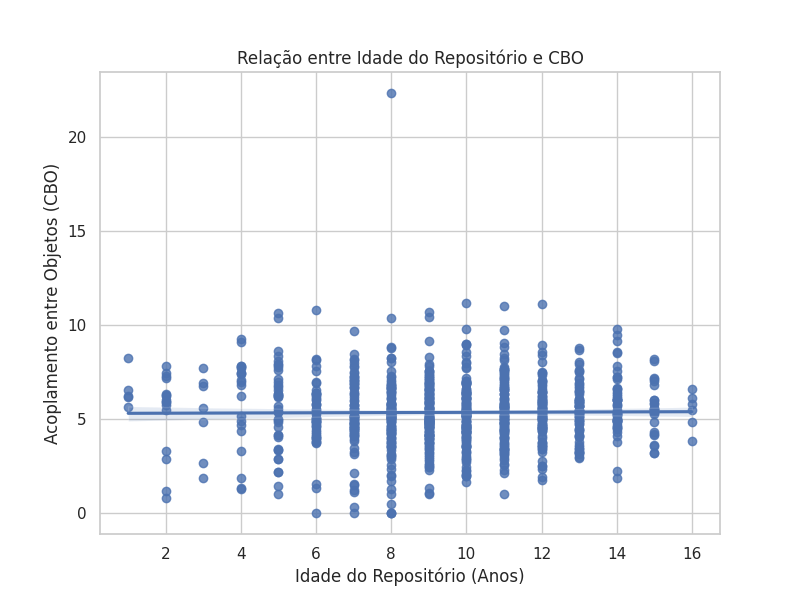
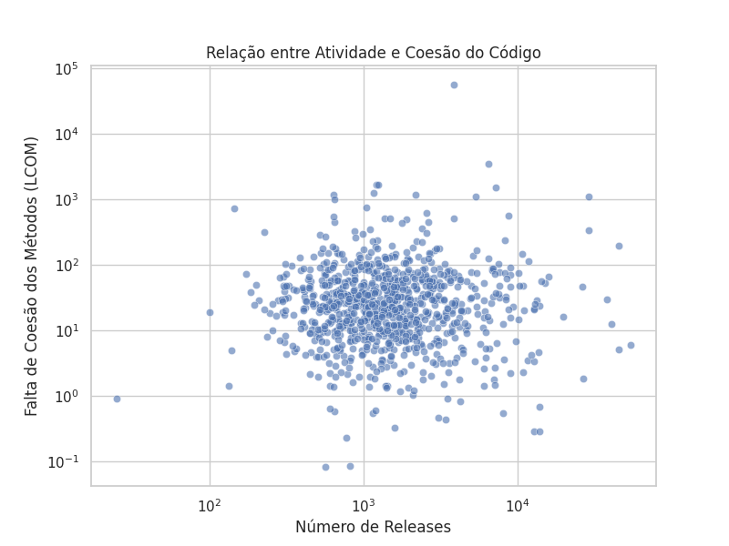

# Relatório Final - Análise das Características de Qualidade de Sistemas Java

## 1. Introdução

O objetivo deste estudo é analisar aspectos da qualidade de repositórios desenvolvidos na linguagem Java, correlacionando-os com características do seu processo de desenvolvimento. Para isso, foram coletadas diversas métricas de qualidade utilizando a ferramenta CK, e os dados foram cruzados com informações sobre **popularidade, tamanho, atividade e maturidade** dos repositórios.

## 2. Metodologia

### 2.1 Coleta de Dados

A coleta de dados seguiu os seguintes passos:

1. Foram extraídos os **1.000 repositórios Java mais populares** do GitHub utilizando a API REST do GitHub.
2. Para cada repositório, foram coletadas informações como:
   * **Popularidade** : número de estrelas.
   * **Tamanho** : linhas de código (LOC) e linhas comentadas (CLOC).
   * **Atividade** : número de releases.
   * **Maturidade** : idade do repositório, calculada com base na data de criação.
3. Os repositórios foram clonados localmente, e a ferramenta **CK** foi utilizada para calcular métricas de qualidade, incluindo:
   * **CBO** (Coupling Between Objects) Mede o acoplamento entre classes, indicando dependências excessivas entre módulos.
   * **DIT** (Depth Inheritance Tree) Mede a profundidade da hierarquia de herança, o que pode impactar a complexidade da manutenção.
   * **LCOM** (Lack of Cohesion of Methods) Avalia a coesão de uma classe, indicando se os métodos são bem relacionados entre si.
4. Os resultados foram consolidados em um arquivo **final_metrics.csv** contendo os valores agregados por repositório.

### 2.2 Perguntas de Pesquisa

As seguintes perguntas de pesquisa foram formuladas para orientar a análise:

* **RQ 01:** Qual a relação entre a popularidade dos repositórios e as suas características de qualidade?
* **RQ 02:** Qual a relação entre a maturidade dos repositórios e as suas características de qualidade?
* **RQ 03:** Qual a relação entre a atividade dos repositórios e as suas características de qualidade?
* **RQ 04:** Qual a relação entre o tamanho dos repositórios e as suas características de qualidade?

### 2.3 Hipóteses

Antes da análise dos dados, formulamos as seguintes hipóteses:

1. **Repositórios mais populares (mais estrelas) tendem a ser maiores (mais linhas de código).**
2. **Repositórios mais maduros (mais antigos) apresentam menor acoplamento (CBO) devido a refatorações ao longo do tempo.**
3. **Repositórios com mais releases possuem maior coesão (menor LCOM).**
4. **Projetos com maior profundidade de herança (DIT) são mais difíceis de manter.**

## 3. Resultados

### 3.1 Correlações Encontradas

Os coeficientes de correlação entre as variáveis-chave foram:

* **Popularidade (Stars) vs Tamanho (LOC)** → Correlação: fraca.
* **Idade do repositório (Repo Age) vs CBO** → Correlação: nenhuma
* **Número de Releases vs Coesão (LCOM)** → Correlação: nenhuma
* **Tamanho do Repositório (LOC) vs Profundidade de Herança (DIT)** →fraca

### 3.2 Análise das Hipóteses

1. **Repositórios mais populares são maiores?**

   🔹 A correlação encontrada foi  **fraca** , indicando uma relação fraca entre popularidade e tamanho do código. Ou seja, **repositórios mais populares tendem a ser ligeiramente maiores, mas isso não é uma regra.**
2. **Repositórios mais antigos têm menor acoplamento?**

   🔹 A correlação entre idade do repositório e CBO foi  **nenhuma** , **indicando que não há relação significativa** entre maturidade e redução de acoplamento.
3. **Repositórios com mais releases são mais coesos?**

   🔹 A correlação entre **Releases e LCOM** foi  **nenhuma**, o que significa que  **a atividade do repositório não parece influenciar a coesão do código** .
4. **Projetos maiores têm mais herança?**

   🔹 A correlação entre **LOC e DIT** foi  **fraca**, mostrando uma relação fraca. **Projetos maiores podem ter uma hierarquia mais profunda, mas isso não é uma regra geral.**

### 3.3 Perguntas de Pesquisa

**RQ 01: Qual a relação entre a popularidade dos repositórios e as suas características de qualidade?**

A correlação entre **número de estrelas (Stars) e tamanho do código (LOC)** foi fraca.

Isso sugere que  **repositórios populares tendem a ser um pouco maiores, mas não há uma relação forte** .

O **gráfico de dispersão** mostrou que há alguns repositórios grandes e populares, mas muitos pequenos também têm alta popularidade.

---

**RQ 02: Qual a relação entre a maturidade dos repositórios e as suas características de qualidade?**

A correlação entre **idade do repositório (Repo Age) e acoplamento (CBO)** foi nenhuma.

Isso indica que  **repositórios mais antigos não necessariamente apresentam um menor acoplamento** .

O **gráfico de tendência** não mostrou um padrão claro de diminuição do acoplamento com a idade.

---

 **RQ 03: Qual a relação entre a atividade dos repositórios e as suas características de qualidade?**

A correlação entre **número de releases (Releases) e coesão (LCOM)** foi nenhuma.

Isso sugere que  **repositórios mais ativos não apresentam um código significativamente mais coeso** .

 O **gráfico de dispersão** mostrou uma distribuição aleatória, sem tendência clara.

---

**RQ 04: Qual a relação entre o tamanho dos repositórios e as suas características de qualidade?**

A correlação entre **linhas de código (LOC) e profundidade da herança (DIT)** foi fraca.

Isso indica que  **projetos maiores podem ter hierarquias de herança um pouco mais profundas, mas não é uma regra geral** .

O **gráfico de dispersão** mostrou que  **tamanho e profundidade de herança variam bastante entre os repositórios** .

## Gráficos

## 5. Conclusão

Com base na análise dos dados, podemos concluir que  **as hipóteses iniciais foram em grande parte refutadas** . Embora algumas tendências tenham sido observadas, não há correlações fortes entre as métricas de qualidade do código e as características do repositório. Para estudos futuros, recomenda-se incluir métricas adicionais e considerar fatores externos como metodologias de desenvolvimento e tipos de aplicação.
