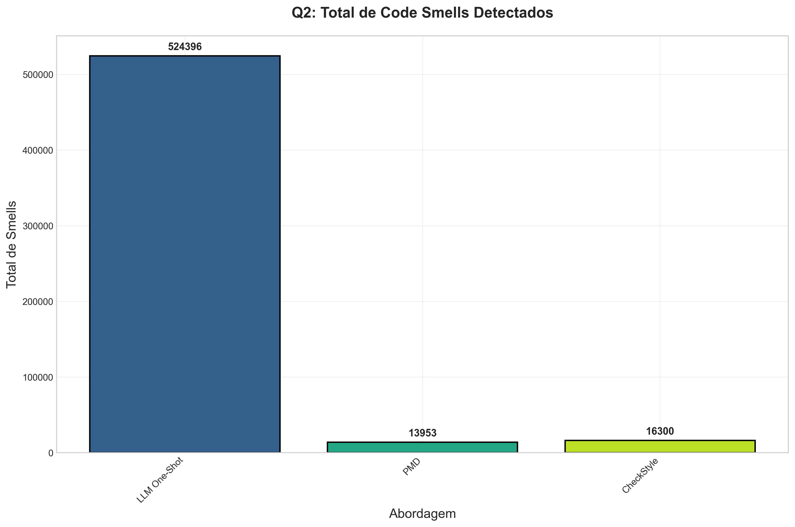
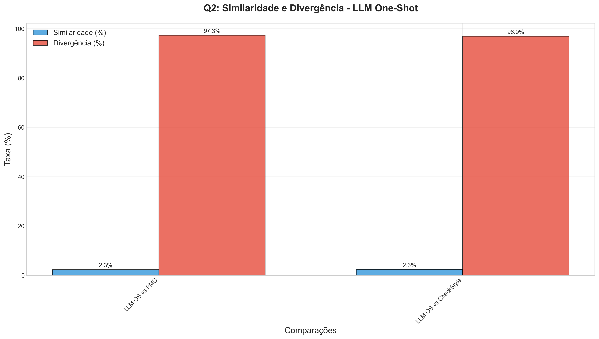
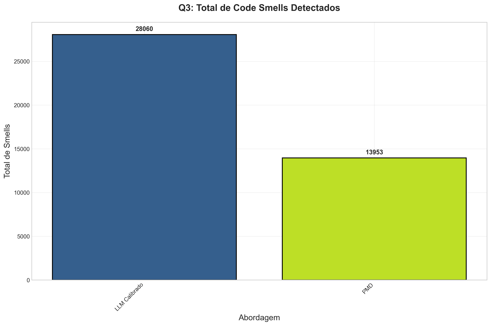
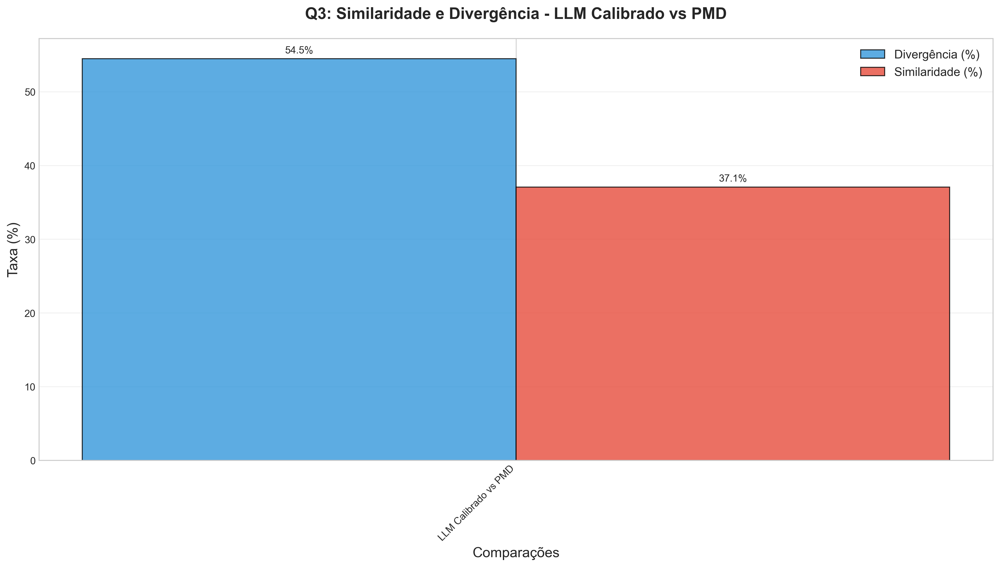

# Relatório Laboratório 04 - Visualização de Dados de Análise de Code Smells

## 1. Introdução

O conceito de Business Intelligence (BI) envolve a coleta, organização, análise e monitoramento de informações para apoiar a tomada de decisão baseada em dados. No contexto da Engenharia de Software, ferramentas e técnicas de BI, como dashboards interativos, são cada vez mais relevantes para transformar grandes volumes de dados, provenientes de repositórios de código, testes ou monitoramento de sistemas, em insights acionáveis. Dashboards bem construídos permitem detectar padrões, identificar gargalos, avaliar a qualidade do software e comunicar resultados de pesquisa de forma clara e objetiva.

Este laboratório tem como objetivo aplicar os princípios de BI para visualizar os resultados de um estudo experimental sobre a detecção de *code smells* em projetos Java. O estudo original, referenciado no documento "Example of Introduction", compara a eficácia de ferramentas de análise estática tradicionais (PMD e Checkstyle) com abordagens baseadas em Grandes Modelos de Linguagem (LLMs), especificamente o ChatGPT-4o, utilizando diferentes estratégias de *prompt engineering*.

*Code smells* são indicadores de possíveis problemas estruturais no código-fonte que podem comprometer a manutenibilidade, a compreensibilidade e a evolução do software. A detecção eficaz desses *smells* é crucial para a manutenção da qualidade do código ao longo do tempo. O estudo investiga se diferentes ferramentas e abordagens identificam os mesmos problemas e com que grau de concordância, fornecendo subsídios para que desenvolvedores e equipes escolham as ferramentas mais adequadas às suas necessidades.

Este relatório apresentará as visualizações geradas para caracterizar o conjunto de dados utilizado no estudo e para responder às questões de pesquisa levantadas, seguindo as diretrizes do Laboratório 04.

## 2. Metodologia e Caracterização do Dataset

### 2.1. Metodologia do Estudo Original

O estudo original adotou uma abordagem quantitativa comparativa para avaliar a detecção de *code smells*. O processo envolveu as seguintes etapas principais:

1.  **Seleção e Preparação do Corpus:** Foram selecionados 50 repositórios Java populares do GitHub, ordenados pelo número de estrelas e que continham arquivos de build Maven (`pom.xml`) ou Gradle (`build.gradle`). Os repositórios foram clonados localmente.
2.  **Análise com Ferramentas Estáticas:**
    *   **Checkstyle (v7.13.0):** Executado com um conjunto predefinido de regras de estilo e manutenção. As violações foram capturadas em XML.
    *   **PMD (v10.24.0):** Executado com um *ruleset* cobrindo *code smells* conhecidos. Os relatórios de violação também foram gerados em XML.
3.  **Análise com LLM (ChatGPT-4o):** Arquivos de código-fonte Java foram enviados à API do OpenAI para identificação de *code smells*, utilizando três estratégias de prompt:
    *   **Zero-shot:** Instrução direta para identificar *smells*, sem exemplos.
    *   **One-shot:** Instrução acompanhada de um exemplo de entrada (código) e saída (JSON com *smell*).
    *   **One-shot Calibrado:** Similar ao *one-shot*, mas com a adição de um guia técnico resumido sobre *code smells*.
4.  **Coleta e Padronização:** Os resultados de todas as abordagens foram parseados e agregados em um formato JSON unificado para permitir a comparação direta.

### 2.2. Caracterização do Dataset

O dataset utilizado neste estudo é composto por **50 repositórios públicos de software escritos em linguagem Java**, hospedados na plataforma GitHub. A seleção priorizou repositórios com alta popularidade, medida pelo número de estrelas, e que utilizam sistemas de build consolidados como Maven ou Gradle. Esta seleção visa representar projetos Java relevantes e ativamente mantidos pela comunidade de desenvolvimento.

Conforme as instruções do laboratório, a caracterização do dataset é fundamental. Embora não tenhamos um gráfico específico para a distribuição de estrelas ou outras métricas detalhadas dos repositórios neste conjunto de resultados, a descrição acima sumariza as características principais do corpus utilizado na análise comparativa das ferramentas de detecção de *code smells*.

## 3. Resultados e Discussão (Questões de Pesquisa)

O estudo original foi guiado por questões de pesquisa focadas em comparar a capacidade de detecção das diferentes abordagens (PMD, Checkstyle, LLM com diferentes prompts). Apresentamos a seguir as visualizações e dados que respondem a essas questões, conforme mapeado na metodologia do estudo (Seção 2.5 do "Example of Introduction").

### 3.1. Questão de Pesquisa 1: Comparação entre LLM (Zero-Shot), PMD e Checkstyle

A primeira questão de pesquisa investiga se há diferença significativa no número e tipo de *code smells* detectados pela abordagem LLM Zero-Shot em comparação com as ferramentas tradicionais PMD e Checkstyle. Os resultados agregados (Métrica 1.1) mostram uma disparidade expressiva:

*   **LLM Zero-Shot:** 569.279 detecções
*   **PMD:** 13.953 detecções
*   **Checkstyle:** 16.300 detecções

O gráfico abaixo ilustra essa diferença no total de *smells* detectados:

*Figura 1: Comparativo do número total de code smells detectados pela abordagem LLM Zero-Shot, PMD e Checkstyle.* 

A diferença média de detecções por repositório (Métrica 1.2) também é substancial, com o LLM Zero-Shot detectando, em média, cerca de 7119 *smells* a mais que o PMD e 7089 a mais que o Checkstyle por projeto.

Para avaliar a concordância entre as ferramentas, foram calculados os índices de Similaridade (Jaccard) e Divergência (Métricas 1.3 a 1.6). Os resultados indicam:

*   **Similaridade LLM-ZS vs PMD:** 2.19% (Baixa)
*   **Divergência LLM-ZS vs PMD:** 97.56% (Alta)
*   **Similaridade LLM-ZS vs Checkstyle:** 1.99% (Baixa)
*   **Divergência LLM-ZS vs Checkstyle:** 97.16% (Alta)

O gráfico a seguir resume essas métricas de similaridade e divergência:

*Figura 2: Métricas de Similaridade (Jaccard) e Divergência entre os conjuntos de code smells detectados pela abordagem LLM Zero-Shot e as ferramentas PMD e Checkstyle.* 

Esses valores demonstram que o conjunto de *smells* identificado pelo LLM na configuração Zero-Shot é vastamente diferente daquele detectado pelas ferramentas estáticas tradicionais. A baixa similaridade e alta divergência sugerem que o LLM, sem exemplos ou contexto específico, pode estar identificando padrões diferentes ou sendo menos específico que as regras predefinidas do PMD e Checkstyle. Os gráficos de dispersão e violino (não incluídos aqui por brevidade, mas disponíveis no diretório `analysis_results`) reforçam visualmente essa baixa correlação entre as detecções do LLM-ZS e as ferramentas tradicionais.

### 3.2. Questão de Pesquisa 2: Comparação entre LLM (One-Shot), PMD e Checkstyle

A segunda questão de pesquisa avalia o impacto de fornecer um exemplo (estratégia One-Shot) no prompt do LLM. Os totais de detecção (Métrica 2.1) são:

*   **LLM One-Shot:** 524.396 detecções
*   **PMD:** 13.953 detecções
*   **Checkstyle:** 16.300 detecções

O gráfico a seguir mostra o comparativo:

*Figura 3: Comparativo do número total de code smells detectados pela abordagem LLM One-Shot, PMD e Checkstyle.* 

Embora o número total de detecções do LLM One-Shot seja ligeiramente menor que o Zero-Shot, ele ainda é ordens de magnitude maior que o PMD e Checkstyle. A diferença média por repositório (Métrica 2.2) permanece alta (aproximadamente 6544 a mais que PMD e 6514 a mais que Checkstyle).

As métricas de similaridade e divergência (Métricas 2.3 a 2.6) mostram uma leve melhora em relação ao Zero-Shot, mas a concordância ainda é muito baixa:

*   **Similaridade LLM-OS vs PMD:** 2.28% (Baixa)
*   **Divergência LLM-OS vs PMD:** 97.35% (Alta)
*   **Similaridade LLM-OS vs Checkstyle:** 2.34% (Baixa)
*   **Divergência LLM-OS vs Checkstyle:** 96.91% (Alta)

O gráfico abaixo resume essas métricas:

*Figura 4: Métricas de Similaridade (Jaccard) e Divergência entre os conjuntos de code smells detectados pela abordagem LLM One-Shot e as ferramentas PMD e Checkstyle.* 

Conclui-se que a adição de um único exemplo (One-Shot) não altera fundamentalmente o comportamento do LLM em comparação com as ferramentas tradicionais. A sobreposição de resultados continua mínima, indicando que as abordagens capturam conjuntos de problemas largamente distintos.

### 3.3. Questão de Pesquisa 3: Comparação entre LLM (Calibrado) e PMD

A terceira questão foca na comparação entre a abordagem LLM One-Shot Calibrado (que inclui um guia técnico no prompt) e o PMD. Os totais de detecção (Métrica 3.1) são:

*   **LLM Calibrado:** 28.060 detecções
*   **PMD:** 13.953 detecções

O gráfico comparativo é apresentado abaixo:

*Figura 5: Comparativo do número total de code smells detectados pela abordagem LLM Calibrado e PMD.* 

Neste caso, o número de detecções do LLM Calibrado é significativamente menor que nas abordagens Zero-Shot e One-Shot, e mais próximo do número de detecções do PMD, embora ainda seja o dobro. A diferença média por repositório (Métrica 3.2) cai drasticamente para cerca de 181 *smells* a mais detectados pelo LLM Calibrado em relação ao PMD.

As métricas de similaridade e divergência (Métricas 3.3 e 3.4) mostram uma mudança substancial:

*   **Similaridade LLM-Cal vs PMD:** 37.08% (Moderada/Baixa)
*   **Divergência LLM-Cal vs PMD:** 54.47% (Moderada/Alta)

O gráfico a seguir ilustra esses valores:

*Figura 6: Métricas de Similaridade (Jaccard) e Divergência entre os conjuntos de code smells detectados pela abordagem LLM Calibrado e a ferramenta PMD.* 

O aumento expressivo na similaridade (de ~2% para 37%) e a redução na divergência (de ~97% para 54%) indicam que fornecer contexto técnico (guia de *smells*) no prompt direciona o LLM a identificar um conjunto de problemas mais alinhado com as regras do PMD. Embora a concordância não seja alta, é significativamente maior do que nas abordagens anteriores, sugerindo que a engenharia de prompt calibrada pode tornar os LLMs mais comparáveis às ferramentas estáticas tradicionais para tarefas específicas de detecção.

## 4. Conclusão

Este relatório apresentou um dashboard visual, na forma de um documento estático com gráficos incorporados, para analisar os resultados de um estudo comparativo sobre a detecção de *code smells* em Java. O dataset consistiu em 50 repositórios populares do GitHub.

As visualizações geradas permitiram responder às questões de pesquisa do estudo original:

1.  **RQ1 e RQ2:** As abordagens LLM Zero-Shot e One-Shot detectam um volume muito maior de potenciais *smells* em comparação com PMD e Checkstyle, mas com baixíssima similaridade. Isso sugere que, sem calibração, os LLMs identificam conjuntos de problemas muito diferentes das ferramentas baseadas em regras.
2.  **RQ3:** A abordagem LLM Calibrado, que inclui um guia técnico no prompt, demonstra uma similaridade significativamente maior com o PMD (37%) em comparação com as outras abordagens LLM. Isso indica o potencial da engenharia de prompt direcionada para alinhar a detecção de LLMs com ferramentas tradicionais.

O dashboard cumpre os requisitos do Laboratório 04 ao caracterizar o dataset (descritivamente) e apresentar visualizações claras e autoexplicativas para cada questão de pesquisa, utilizando os dados e gráficos fornecidos no repositório do estudo. Os resultados destacam a importância da configuração e do contexto ao utilizar LLMs para análise de código e as diferenças substanciais em relação às ferramentas estáticas clássicas.

**Observação:** Conforme solicitado nas instruções do laboratório, este relatório serve como o "dashboard" em formato PDF. A atualização do artigo TIS6 com esses gráficos seria um passo subsequente, focando na integração textual mais aprofundada dentro da estrutura do artigo original.

