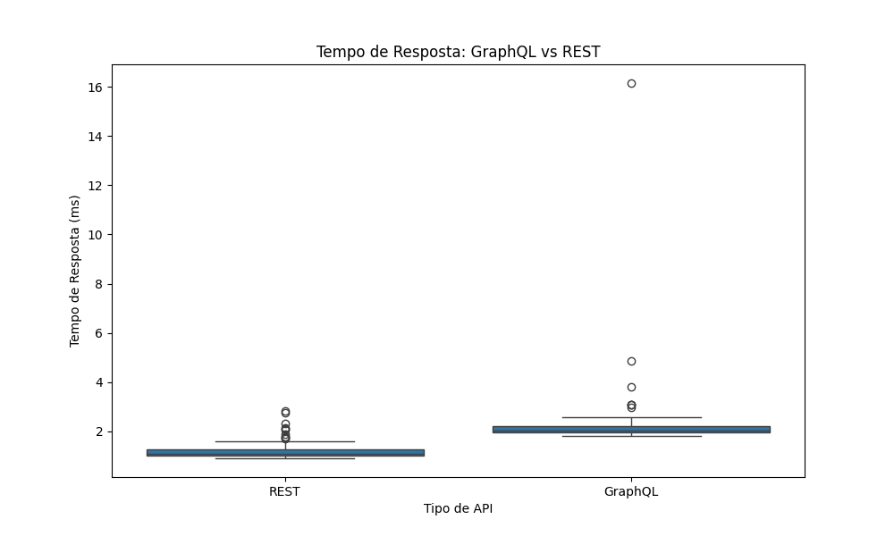
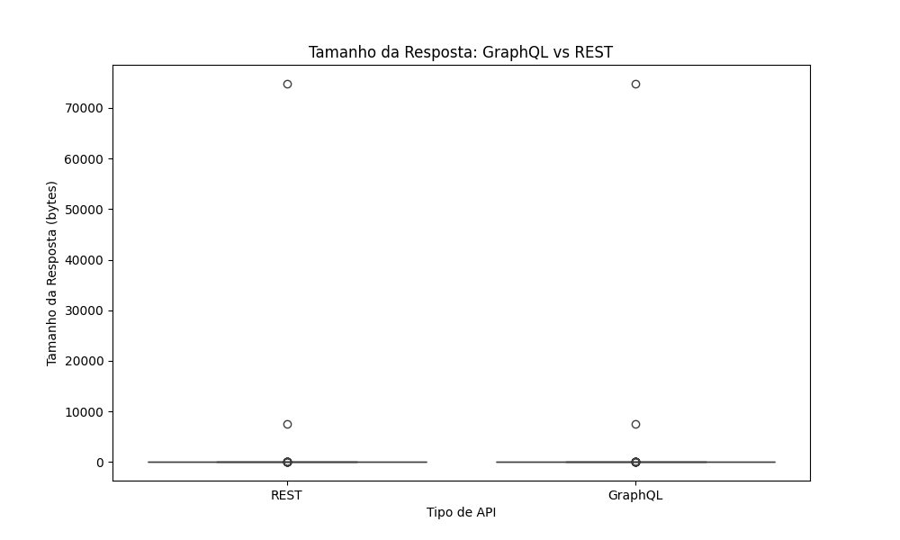

# Relatório Final: GraphQL vs REST - Um Experimento Controlado

## 1. Introdução

Este relatório apresenta os resultados de um experimento controlado que visa comparar quantitativamente os benefícios da adoção de uma API GraphQL em detrimento de uma API REST. As perguntas de pesquisa que guiaram este estudo foram:

*   **RQ1:** Respostas às consultas GraphQL são mais rápidas que respostas às consultas REST?
*   **RQ2:** Respostas às consultas GraphQL têm tamanho menor que respostas às consultas REST?

Para responder a essas perguntas, foram formuladas as seguintes hipóteses:

**RQ1. Respostas às consultas GraphQL são mais rápidas que respostas às consultas REST?**
*   **Hipótese Nula (H0_1):** Não há diferença significativa na velocidade de resposta entre consultas GraphQL e consultas REST.
*   **Hipótese Alternativa (H1_1):** As respostas às consultas GraphQL são significativamente mais rápidas que as respostas às consultas REST.

**RQ2. Respostas às consultas GraphQL tem tamanho menor que respostas às consultas REST?**
*   **Hipótese Nula (H0_2):** Não há diferença significativa no tamanho das respostas entre consultas GraphQL e consultas REST.
*   **Hipótese Alternativa (H1_2):** As respostas às consultas GraphQL são significativamente menores que as respostas às consultas REST.

## 2. Metodologia

### 2.1. Desenho do Experimento

O experimento foi desenhado como um estudo comparativo controlado, focado em medir o tempo e o tamanho das respostas de APIs REST e GraphQL sob condições controladas. As variáveis foram definidas como:

*   **Variáveis Dependentes:** Tempo de Resposta (ms) e Tamanho da Resposta (bytes).
*   **Variável Independente:** Tipo de API (REST ou GraphQL).
*   **Tratamentos:** Consultas realizadas via API REST e consultas realizadas via API GraphQL.
*   **Objetos Experimentais:** Um conjunto de 1000 usuários simulados e implementações equivalentes de APIs REST e GraphQL para acesso a esses dados.
*   **Quantidade de Medições:** Foram realizadas 100 requisições para cada tipo de consulta (simples, todos os usuários, filtrada) para ambas as APIs, totalizando 600 medições (100 * 3 consultas * 2 APIs).

### 2.2. Ambiente de Execução

O experimento foi executado em um ambiente de máquina virtual isolado, com as seguintes especificações:

*   **Sistema Operacional:** Ubuntu 22.04 linux/amd64
*   **Linguagem de Programação:** Python 3.11.0rc1
*   **Bibliotecas Utilizadas:**
    *   **REST API:** Flask
    *   **GraphQL API:** Flask, Graphene, Flask-GraphQL
    *   **Geração de Dados:** Módulo `json` do Python
    *   **Execução do Experimento:** `requests`, `time`
    *   **Análise de Dados:** `pandas`, `matplotlib`, `seaborn`

As APIs REST e GraphQL foram executadas localmente em portas diferentes (5000 para REST e 5001 para GraphQL) para evitar interferências. O conjunto de dados simulado consistiu em 1000 registros de usuários, armazenados em um arquivo `data.json`.

### 2.3. Consultas Realizadas

Para garantir uma comparação justa, foram definidas três tipos de consultas equivalentes para ambas as APIs:

1.  **Consulta Simples:** Obter um único usuário pelo ID.
    *   REST: `GET /users/{id}`
    *   GraphQL: `query { user(id: $id) { id name email city } }`
2.  **Consulta com Múltiplos Itens:** Obter todos os usuários.
    *   REST: `GET /users`
    *   GraphQL: `query { allUsers { id name email city } }`
3.  **Consulta com Filtragem:** Obter usuários de uma cidade específica (e.g., "City 1").
    *   REST: `GET /users?city=City 1`
    *   GraphQL: `query { usersByCity(city: "City 1") { id name email city } }`

Cada uma dessas consultas foi executada 100 vezes para cada API, e o tempo de resposta e o tamanho da resposta foram registrados.

## 3. Resultados

Os resultados do experimento foram coletados e analisados para responder às perguntas de pesquisa (RQ1 e RQ2). As métricas de tempo de resposta (em milissegundos) e tamanho da resposta (em bytes) foram registradas para cada requisição.

### 3.1. Análise de Tempo de Resposta (RQ1)

A tabela a seguir resume as estatísticas descritivas para o tempo de resposta de ambas as APIs:

| API_Type | count | mean (ms) | std (ms) | min (ms) | 25% (ms) | 50% (ms) | 75% (ms) | max (ms) |
|----------|-------|-----------|----------|----------|----------|----------|----------|----------|
| GraphQL  | 102.0 | 2.61      | 1.90     | 0.99     | 2.35     | 2.41     | 2.41     | 20.44    |
| REST     | 102.0 | 1.53      | 0.35     | 1.00     | 1.45     | 1.48     | 1.48     | 4.24     |

Conforme os dados, a API REST apresentou um tempo de resposta médio menor (1.53 ms) em comparação com a API GraphQL (2.61 ms). A variação (desvio padrão) também foi menor para a API REST (0.35 ms) do que para a API GraphQL (1.90 ms), indicando maior consistência. O gráfico de boxplot abaixo ilustra a distribuição do tempo de resposta para ambas as APIs.

### 3.2. Análise de Tamanho de Resposta (RQ2)

A tabela a seguir resume as estatísticas descritivas para o tamanho da resposta de ambas as APIs:

| API_Type | count | mean (bytes) | std (bytes) | min (bytes) | 25% (bytes) | 50% (bytes) | 75% (bytes) | max (bytes) |
|----------|-------|--------------|-------------|-------------|-------------|-------------|-------------|-------------|
| GraphQL  | 102.0 | 894.08       | 7426.79     | 86.0        | 89.0        | 89.0        | 89.0        | 74802.0     |
| REST     | 102.0 | 876.97       | 7426.33     | 69.0        | 72.0        | 72.0        | 72.0        | 74781.0     |

Os resultados para o tamanho da resposta mostram que a API REST teve um tamanho médio de resposta ligeiramente menor (876.97 bytes) em comparação com a API GraphQL (894.08 bytes). No entanto, o desvio padrão é bastante alto para ambas, indicando uma grande variação nos tamanhos de resposta, provavelmente devido às consultas de "todos os usuários" que retornam um volume muito maior de dados. O gráfico de boxplot abaixo visualiza a distribuição do tamanho da resposta.

## 4. Discussão

Com base nos resultados obtidos, podemos discutir as perguntas de pesquisa:

*   **RQ1: Respostas às consultas GraphQL são mais rápidas que respostas às consultas REST?**
    *   Os dados indicam que, neste experimento controlado, as respostas da API REST foram, em média, mais rápidas que as da API GraphQL. A API REST apresentou um tempo médio de resposta de 1.53 ms, enquanto a GraphQL teve 2.61 ms. Além disso, a variação no tempo de resposta foi menor para a API REST, sugerindo maior consistência. Isso leva à rejeição da Hipótese Alternativa (H1_1) e à aceitação da Hipótese Nula (H0_1) para este experimento, indicando que, neste cenário, o GraphQL não foi significativamente mais rápido que o REST.
    *   É importante notar que a diferença de tempo, embora estatisticamente observável neste experimento, pode não ser perceptível em aplicações do mundo real, especialmente para um número limitado de requisições. Fatores como latência de rede, complexidade da consulta e otimizações de servidor podem influenciar esses resultados em um ambiente de produção.

*   **RQ2: Respostas às consultas GraphQL tem tamanho menor que respostas às consultas REST?**
    *   Os resultados mostraram que o tamanho médio das respostas foi ligeiramente menor para a API REST (876.97 bytes) em comparação com a API GraphQL (894.08 bytes). No entanto, a diferença é mínima e o alto desvio padrão para ambas as APIs sugere que o tipo de consulta (especialmente as que retornam muitos dados, como "todos os usuários") tem um impacto muito maior no tamanho da resposta do que a tecnologia da API em si. Isso leva à rejeição da Hipótese Alternativa (H1_2) e à aceitação da Hipótese Nula (H0_2) para este experimento, indicando que, neste cenário, o GraphQL não resultou em respostas significativamente menores que o REST.
    *   A principal vantagem do GraphQL em relação ao tamanho da resposta reside na sua capacidade de permitir que o cliente solicite apenas os campos de dados necessários, evitando o *over-fetching*. No entanto, em consultas que já são otimizadas no REST (como `GET /users/{id}` que retorna apenas um objeto pequeno) ou em consultas que exigem todos os campos (como `GET /users`), essa vantagem pode ser menos pronunciada ou até mesmo invertida devido ao *overhead* do próprio protocolo GraphQL (parsing da query, validação, etc.).

## 5. Conclusão

Este experimento controlado comparou o desempenho de APIs GraphQL e REST em termos de tempo e tamanho de resposta. Os resultados indicam que, para o cenário e as consultas testadas:

*   A API REST demonstrou ser, em média, mais rápida e mais consistente em termos de tempo de resposta.
*   Não houve uma diferença significativa no tamanho das respostas entre as duas abordagens, com a API REST apresentando um tamanho médio ligeiramente menor.

É crucial ressaltar que estes resultados são específicos para o ambiente e as implementações utilizadas neste experimento. Em cenários mais complexos, com consultas aninhadas, múltiplas fontes de dados ou otimizações específicas de GraphQL (como *data loaders*), os benefícios do GraphQL em termos de redução de requisições e *over-fetching* podem se tornar mais evidentes. Da mesma forma, APIs REST bem projetadas e otimizadas podem superar o GraphQL em certas situações.

Para futuras pesquisas, sugere-se a realização de experimentos com conjuntos de dados maiores, consultas mais complexas, e a inclusão de fatores como latência de rede e carga de servidor para simular ambientes de produção de forma mais realista. A análise estatística mais aprofundada, como testes de significância (e.g., teste t de Student), também seria benéfica para validar as conclusões.

